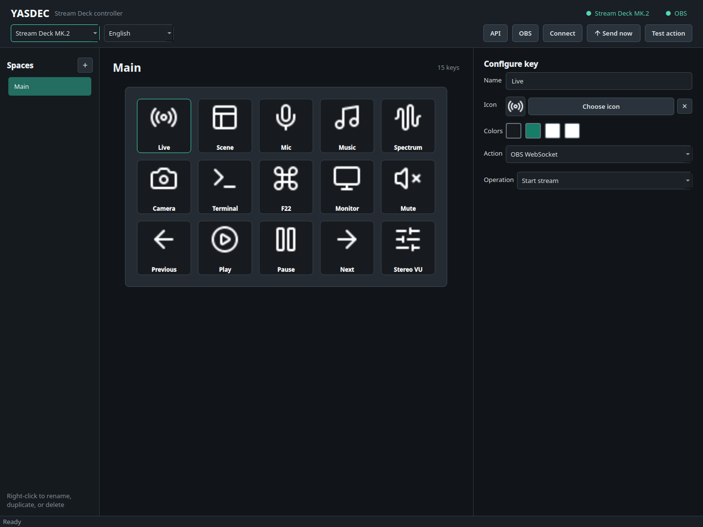
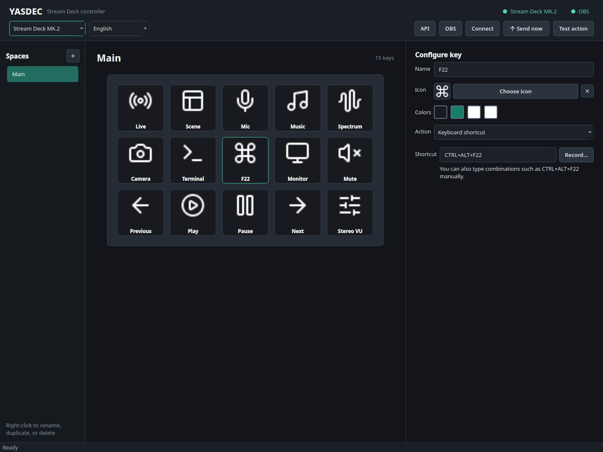
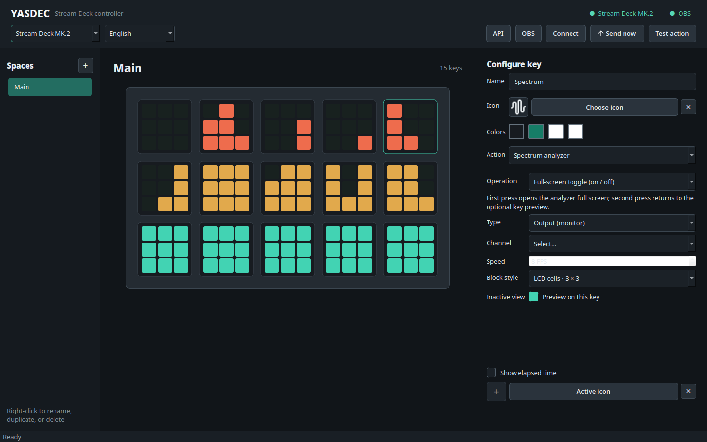
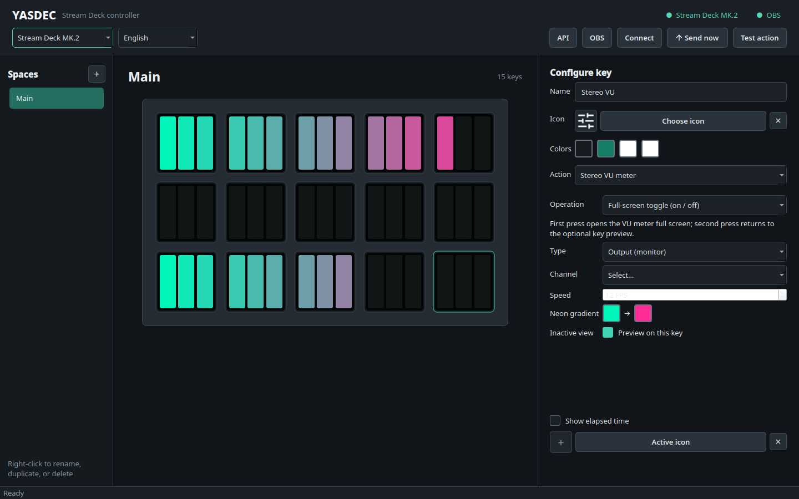

# YASDEC

> YASDEC is, of course, a *very original* name. I am old enough to have watched
> both Wine and YAML being born, so this is about as much of a sense of humor as
> I have left.

**YASDEC — Yet Another Stream Deck Controller** is a resident Qt desktop application for configuring and controlling
Elgato Stream Deck devices on Linux. It provides a visual key editor, custom
icons, persistent toggle states, virtual spaces, application launching, OBS
control, PipeWire/PulseAudio actions, WebSocket and shell commands, an HTTP API,
and a full-deck spectrum analyzer.



### Interface previews

| Keyboard shortcut recorder | Full-deck 3 × 3 LCD spectrum |
| --- | --- |
|  |  |

The editor supports Stream Deck Mini, Original, MK.2, Neo, and XL layouts. When
compatible hardware is connected, YASDEC detects the model and adjusts the grid
automatically. Models centered around dials are not currently supported.

## Features

- Visual editor for keys and virtual spaces.
- Copy and paste complete key configurations from one button to another.
- OBS WebSocket 5 integration, including sources inside groups.
- PipeWire/PulseAudio device, microphone, and application-stream control.
- Full-deck spectrum analyzer with an optional per-key preview.
- Horizontal stereo VU meter with configurable neon gradient and mini preview.
- Freedesktop application launcher compatible with GNOME, KDE Plasma,
  Cinnamon, XFCE, and MATE.
- Shell commands, text WebSocket messages, toggle actions, and active timers.
- Global virtual-keyboard shortcuts on Wayland and X11 through Linux `uinput`.
- Ordered multi actions with independent In/Out sequences and pauses.
- Local authenticated HTTP API for integrations and automation.
- English and Spanish interfaces backed by external translation catalogs.
- System tray operation so the controller can keep running with the editor
  hidden.

## Requirements

- Linux with Python 3.11 or newer.
- `pactl` for audio discovery and mute control.
- `parec` for spectrum capture.
- OBS Studio with WebSocket 5 enabled for OBS actions.
- HID/udev permissions for physical Stream Deck access.
- `uinput` permissions when virtual keyboard shortcuts are used.

The editor can run without OBS, audio tools, or Stream Deck hardware. Features
whose dependencies are unavailable will simply remain disabled.

## Installation

Using a virtual environment is recommended:

```bash
python3 -m venv .venv
source .venv/bin/activate
python3 -m pip install --upgrade pip
python3 -m pip install -r requirements.txt
```

Alternatively, install the project as an editable Python package:

```bash
python3 -m pip install -e .
```

The `hardware` optional dependency can also be selected explicitly:

```bash
python3 -m pip install -e '.[hardware]'
```

### AppImage

YASDEC can be packaged as a self-contained AppImage. Install the build tools in
an isolated environment, provide `appimagetool`, and run:

```bash
python3 -m pip install -r requirements-build.txt
APPIMAGETOOL=/path/to/appimagetool ./packaging/build-appimage.sh
```

The build produces `dist/YASDEC-x86_64.AppImage` and a matching SHA-256 file.
On Bazzite, Gear Lever can integrate the AppImage with the application menu.

### Continuous integration

The GitHub Actions workflow in `.github/workflows/appimage.yml` runs on every
push and pull request, and can also be started manually. It performs the
following checks on Ubuntu 22.04 with Python 3.11:

1. Installs the complete runtime and build requirements.
2. Compiles the Python sources and validates both translation catalogs.
3. Runs the complete unit-test suite.
4. Builds and checksum-validates the x86_64 AppImage.
5. Performs a headless startup smoke test.
6. Uploads the AppImage and its `.sha256` file as the
   `YASDEC-AppImage-x86_64` workflow artifact.

Pushing a tag matching `v*`—for example `v0.1.0`—also creates or updates the
corresponding GitHub Release and attaches both generated files. The workflow
uses the versioned AppImage `appimagetool` 1.9.1 release rather than the older
obsolete AppImageKit build, and verifies the downloaded tool against its pinned
SHA-256 checksum before executing it.

## Running YASDEC

Start the application from the source tree with:

```bash
./run.sh
```

Closing the window does not stop the controller when a system tray is
available. Use the tray menu or `Ctrl+Q` to quit completely. When launched from
a terminal, `Ctrl+C` also performs a clean shutdown.

To add YASDEC to the desktop application menu:

```bash
./install-user.sh
```

To also start YASDEC with the graphical session:

```bash
./install-user.sh --autostart
```

## Interface languages

English is the source language and fallback. The header language selector
offers **System language**, **English**, and **Español**. Restart YASDEC after
changing the selection.

Translation catalogs are stored in:

```text
assets/i18n/en.json
assets/i18n/es.json
```

Additional languages can be introduced without changing application logic.
Installed application names and comments also follow the selected interface
language when their `.desktop` entries provide localized values.

## Physical hardware

The `streamdeck` Python package is included in `requirements.txt`. The desktop
session user must have read/write access to the HID device. Configure the
appropriate udev rules for your distribution and restart YASDEC after connecting
the device.

## Actions

### Copying key configurations

Right-click a key and choose **Copy key configuration**, then right-click any
other key and choose **Paste key configuration**. The complete label, icons,
colors, action, toggle settings, analyzer options, and nested multi-action lists
are copied. Runtime active/timer state is intentionally reset, and YASDEC asks
for confirmation before replacing a key that is already configured.

### Applications

YASDEC discovers standard freedesktop `.desktop` entries from the user and
system application directories as well as desktop shortcuts. Selecting an
application copies its localized name and resolved theme icon to the key.
Launching primarily uses `gio`, with a direct Desktop Entry `Exec` fallback.

This approach works across GNOME, KDE Plasma, Cinnamon, XFCE, and MATE. The
exact list of favorites pinned to a particular desktop dock is intentionally
not read because that configuration is desktop-specific.

### OBS

OBS uses one global authenticated WebSocket 5 connection configured from the
header. Available scenes, sources, groups, and inputs are loaded into editable
selectors.

Supported operations include:

- Switch the current program scene.
- Show or hide a scene source.
- Show or hide a source inside an OBS group.
- Mute or unmute an input.
- Start or stop streaming.

Source visibility is never toggled from a potentially stale local value. YASDEC
first resolves the `sceneItemId`, reads the current state from OBS, and then
applies the inverse state. Local key state changes only after OBS confirms the
request.

For a grouped source, select its parent scene, optional group, and source. To
toggle the group itself, leave the group field empty and select the group as the
source.

### Audio

Audio actions discover outputs, inputs, playback streams, and recording streams
through PipeWire/PulseAudio. Their mute state is periodically synchronized with
the running audio server.

### Spectrum analyzer

A spectrum start key behaves as a toggle:

- Enabled: the analyzer occupies the complete Stream Deck.
- Disabled with **Preview on this key** enabled: capture continues and a mini
  spectrum replaces that key's normal icon.
- Disabled without preview: spectrum capture stops completely.

The Spectrum and Stereo VU start keys are full-screen toggles: the first press
opens the visualization and the second returns to its optional key preview.
Separate stop-only keys are available for layouts that need a dedicated stop
control. Mini Spectrum and mini VU previews can run simultaneously on different
keys; only the full-screen modes are mutually exclusive.
When preview is disabled and no custom icon or symbol is configured, YASDEC
uses a bundled waveform icon for Spectrum or a controls icon for Stereo VU.

Columns represent logarithmic frequency bands and rows represent intensity.
The block style can be solid, a 2 × 2 LCD grid, or a 3 × 3 LCD grid. The 3 × 3
style turns every key into nine small retro colored cells and samples three
frequency bands across each physical key.
Recommended frame rates are 12 FPS for Mini, 8 FPS for Original/MK.2, 10 FPS
for Neo, and 4 FPS for XL. Rendering happens in a worker thread, retains only
the newest pending frame, and skips unchanged keys.

The Original 2019 and MK.2 can transmit the analyzer as one full-screen image
using the official HID command. First-generation BMP models use binary cells to
reduce uncompressed HID traffic.

### Stereo VU meter

The stereo VU action is a toggle like the spectrum analyzer. On a three-row
deck, the upper row displays the left channel and the lower row displays the
right channel. Every physical key contains three full-height segments, giving
15 horizontal segments on a five-column deck. The middle row remains dark.

The start and end colors of the retro neon gradient are configured on the
assigned key. With **Preview on this key** enabled, switching off the full-deck
view keeps stereo capture running and replaces that key's icon with a compact
two-channel meter.



### Shell

Shell actions run through `/bin/sh -lc` with the current user's permissions. A
toggle may define separate enable and disable commands. The following variables
are provided:

```text
SDECK_TOGGLE_STATE    on or off
SDECK_TOGGLE_ACTIVE   1 or 0
SDECK_KEY_INDEX       zero-based key index
SDECK_KEY_LABEL       configured key label
SDECK_SPACE_ID        active space identifier
```

### WebSocket and spaces

WebSocket actions connect to the configured URL, send a text payload, and
disconnect. Valid JSON payloads are normalized before transmission. Space
actions switch to another virtual key grid without launching a process.

### Keyboard shortcuts

Keyboard actions create a persistent virtual keyboard through Linux `uinput`,
so they work globally under Wayland and X11. Shortcuts use `+`-separated key
names such as `F22`, `CTRL+SHIFT+F22`, or `ALT+P`. F13-F24 and common media
keys are supported. The shortcut editor can record the next combination from
the keyboard or remain fully manual, including function keys that are not
physically present on the keyboard.

Install narrowly scoped permissions from a source checkout with:

```bash
sudo ./packaging/install-uinput.sh "$USER"
```

For an AppImage, use its built-in installer:

```bash
./YASDEC-x86_64.AppImage --install-uinput
```

Sign out and back in once after installation. YASDEC then runs without root
privileges. The installer grants only `/dev/uinput` access to the dedicated
`sdeck-input` group; it does not grant access to physical keyboard events.

### Multi actions

A Multi Action key is always a toggle with two independent ordered sequences:

- **In** runs when the key changes from inactive to active.
- **Out** runs when the key changes from active to inactive.

Each list can contain any regular YASDEC action or a pause. Action steps can
request an enabled/on or disabled/off state, which is useful for OBS sources,
audio channels, shell commands, and WebSocket payloads. The key changes visual
state only after its complete sequence finishes, and another press is ignored
while that sequence is running. Nested Multi Actions are intentionally
disallowed.

## Icons and colors

The icon picker includes Lucide icons, UTF-8 symbols, application theme icons,
and custom PNG, JPEG, WebP, or SVG files. A key may use different normal and
active icons, background colors, text colors, and icon tints. Raster photographs
retain their original colors, while SVG and UTF-8 icons can be tinted.

The bundled Lucide license is available at
`assets/icons/lucide/LICENSE`.

## HTTP API

The API listens on `127.0.0.1` by default and supports bearer tokens, Basic
authentication with the token as password, and `X-SDeck-Token`.

```text
GET  /api/v1/state
POST /api/v1/keys/0/press
POST /api/v1/spaces/SPACE_ID/keys/0/press
```

Key indexes are zero-based. State responses never expose passwords, shell
commands, WebSocket payloads, or the API token. Binding to `0.0.0.0` exposes
actions to the local network over plain HTTP; use a trusted network or a secure
reverse proxy.

## Configuration

Configuration is saved automatically under `~/.config/SDeck` on typical Linux
desktops. Application icons imported from the desktop catalog are cached under
`~/.local/share/SDeck`. These internal paths retain the original name so the
YASDEC rename does not lose or duplicate existing user configuration.

Older development builds that accidentally used `~/.config/Backloop/SDeck` are
migrated automatically when the new directory does not exist.

## Tests

The test suite uses Python's standard `unittest` module:

```bash
python3 -m unittest discover -s tests -v
```

## Project layout

```text
sdeck/             Application, UI, and controllers
tests/             Unit tests
assets/            Icons, translations, and visual resources
packaging/         Linux desktop entry template
docs/screenshots/  README screenshots generated from the real Qt interface
.github/workflows/ Automated tests, AppImage builds, and tagged releases
requirements.txt   Complete Python runtime dependencies
requirements-build.txt  Additional AppImage build dependency
pyproject.toml      Package metadata and optional dependency groups
```

## Security notes

- Shell actions execute arbitrary commands with the current user's privileges.
- OBS passwords and API tokens are stored in the application configuration.
- Keep the HTTP API bound to localhost unless remote access is intentional.
- Only select `.desktop` launchers from trusted application directories.
- Virtual keyboard support requires write access only to `/dev/uinput`; never
  run the complete YASDEC application as root.

## License

YASDEC is free software licensed under the **GNU General Public License,
version 3 or any later version** (`GPL-3.0-or-later`). You may use, study,
modify, and redistribute it under those terms. Distributed modified versions
must provide their corresponding source code under the same license.

Copyright © 2026 YASDEC contributors. See [`LICENSE`](LICENSE) for the complete
license text. Bundled third-party components retain their respective licenses;
the Lucide notice is available in [`assets/icons/lucide/LICENSE`](assets/icons/lucide/LICENSE).
